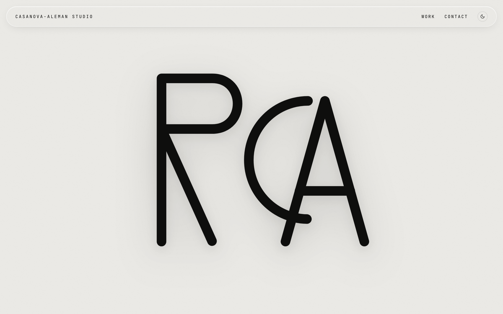

<!-- ───────────────────────────  HERO  ─────────────────────────── -->

<picture>
  <source media="(prefers-color-scheme: dark)" srcset="./assets/header-dark.svg">
  
</picture>

🦈 &nbsp; **Always forward.**

Founder of a startup, a studio, and whatever comes next.

 

<!-- ─────────────────────────  BUILDING  ───────────────────────── -->

#### BUILDING

<table>
<tr>
<td width="50%" valign="top">

  
<b>Gradvisr</b> &nbsp;·&nbsp; <a href="https://gradvisr.com">gradvisr.com</a>
 
My startup. An AI degree planner that turns a UF transcript into a complete, prerequisite-correct path to graduation in seconds.
</td>
<td width="50%" valign="top">

  
<b>Casanova-Aleman Studio</b> &nbsp;·&nbsp; <a href="https://casanovaaleman.com">casanovaaleman.com</a>
 
My web studio. I design and ship premium sites and products for founders and brands.
</td>
</tr>
</table>

**Inside the studio**

<table>
<tr><td><b>Hearts in Motion</b></td><td><a href="https://heartsinmotion.events">heartsinmotion.events</a></td><td>Event platform for a pediatric cancer research charity.</td></tr>
<tr><td><b>Yntegra</b></td><td>private</td><td>Brand and platform for a luxury pickleball Pro-Am.</td></tr>
<tr><td><b>Hammerforge MMA</b></td><td>private</td><td>Site for an MMA gym and fight team.</td></tr>
<tr><td><b>MaxStrong</b></td><td>nonprofit</td><td>Built alongside Hearts in Motion.</td></tr>
</table>

 

<!-- ──────────────────────  CONTRIBUTIONS  ─────────────────────── -->

#### CONTRIBUTIONS

<picture>
  <source media="(prefers-color-scheme: dark)" srcset="https://raw.githubusercontent.com/RSCAV/RSCAV/output/snake-dark.svg">
  
</picture>

 

<!-- ────────────────────────────  ALWAYS  ──────────────────────── -->

#### ALWAYS

AI native, built that way from day one. I stay at the front of the line: always learning, always curious, always growing.

 

<!-- ─────────────────────────  LET'S BUILD  ────────────────────── -->

#### LET'S BUILD

If you are building something ambitious, find me at [casanovaaleman.com](https://casanovaaleman.com) or [rscav06@gmail.com](mailto:rscav06@gmail.com).
