<!--
  This file is generated. Do not edit it by hand.

  The world is drawn by engine/ and rebuilt every day by
  .github/workflows/build-world.yml, so every number below is live.

    node engine/build.mjs      rebuild the bands and this file
    node engine/shot.mjs       render them in Chromium, both themes
-->


<p align="center"><a href="https://propiedash.com" title="PROPIEDASH - The real-estate marketplace for Venezuela">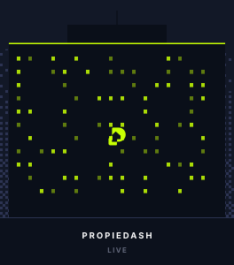</a><a href="https://opennodo.org" title="OPENNODO - An open place standard for Venezuela">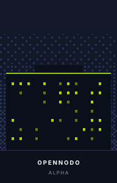</a><a href="https://casanovaaleman.com" title="CASANOVAALEMAN - Design and web studio">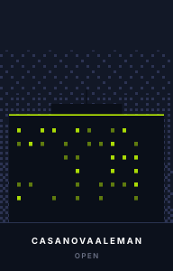</a><a href="https://gradvisr.com" title="GRADVISR - AI degree planner for university students">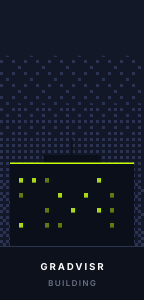</a><a href="https://pinks.com" title="PINK’S - Family burger company, Madrid. I run tech and ops">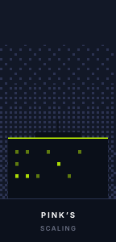</a><a href="https://heartsinmotion.events" title="HEARTS IN MOTION - Event platform for a pediatric cancer charity">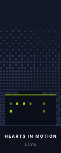</a><a href="https://github.com/RSCAV" title="YNTEGRA - Brand and platform for a luxury pickleball Pro-Am"></a></p>

<a href="https://propiedash.com">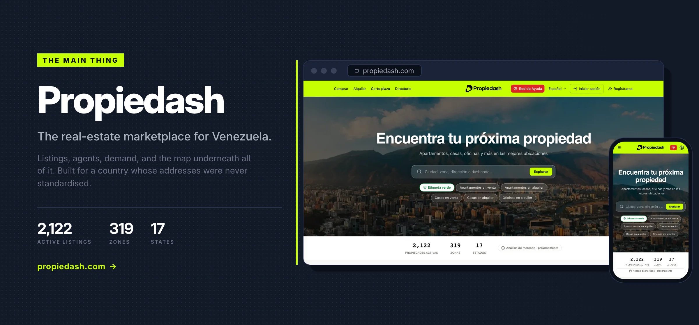</a>

<a href="https://opennodo.org">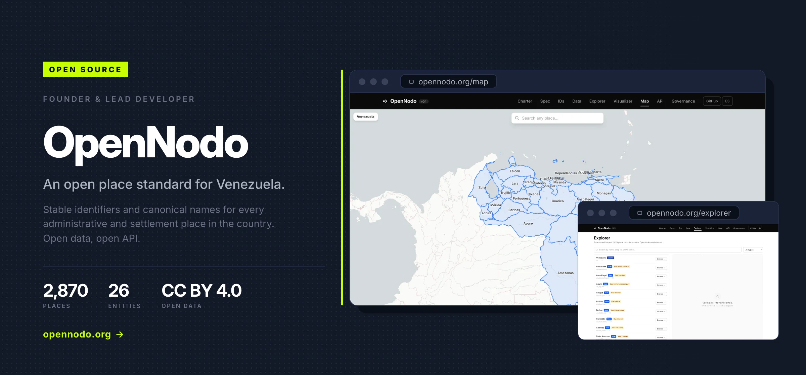</a>

<details>
<summary><b>Open the live map</b> &nbsp;·&nbsp; every OpenNodo federal entity, pan and zoom it</summary>

<br>

Rendered by GitHub from the [OpenNodo](https://opennodo.org) seed pack. Each marker is a
federal entity; the counts are the municipalities and parishes OpenNodo has records for.

```geojson
{"type":"FeatureCollection","features":[{"type":"Feature","properties":{"name":"Distrito Capital","municipios":1,"parroquias":22,"marker-color":"#C7FF02","marker-size":"small"},"geometry":{"type":"Point","coordinates":[-66.969,10.473]}},{"type":"Feature","properties":{"name":"Amazonas","municipios":7,"parroquias":23,"marker-color":"#C7FF02","marker-size":"small"},"geometry":{"type":"Point","coordinates":[-65.781,3.416]}},{"type":"Feature","properties":{"name":"Anzoátegui","municipios":21,"parroquias":58,"marker-color":"#C7FF02","marker-size":"medium"},"geometry":{"type":"Point","coordinates":[-64.128,8.958]}},{"type":"Feature","properties":{"name":"Apure","municipios":7,"parroquias":26,"marker-color":"#C7FF02","marker-size":"medium"},"geometry":{"type":"Point","coordinates":[-68.81,7.074]}},{"type":"Feature","properties":{"name":"Aragua","municipios":18,"parroquias":50,"marker-color":"#C7FF02","marker-size":"medium"},"geometry":{"type":"Point","coordinates":[-66.879,9.894]}},{"type":"Feature","properties":{"name":"Barinas","municipios":12,"parroquias":54,"marker-color":"#C7FF02","marker-size":"medium"},"geometry":{"type":"Point","coordinates":[-69.975,8.174]}},{"type":"Feature","properties":{"name":"Bolívar","municipios":11,"parroquias":47,"marker-color":"#C7FF02","marker-size":"medium"},"geometry":{"type":"Point","coordinates":[-63.472,5.997]}},{"type":"Feature","properties":{"name":"Carabobo","municipios":14,"parroquias":38,"marker-color":"#C7FF02","marker-size":"medium"},"geometry":{"type":"Point","coordinates":[-68.126,10.197]}},{"type":"Feature","properties":{"name":"Cojedes","municipios":9,"parroquias":15,"marker-color":"#C7FF02","marker-size":"small"},"geometry":{"type":"Point","coordinates":[-68.351,9.309]}},{"type":"Feature","properties":{"name":"Delta Amacuro","municipios":4,"parroquias":21,"marker-color":"#C7FF02","marker-size":"small"},"geometry":{"type":"Point","coordinates":[-61.363,8.885]}},{"type":"Feature","properties":{"name":"Falcón","municipios":25,"parroquias":83,"marker-color":"#C7FF02","marker-size":"large"},"geometry":{"type":"Point","coordinates":[-69.511,11.248]}},{"type":"Feature","properties":{"name":"Guárico","municipios":15,"parroquias":39,"marker-color":"#C7FF02","marker-size":"medium"},"geometry":{"type":"Point","coordinates":[-66.381,8.831]}},{"type":"Feature","properties":{"name":"Lara","municipios":9,"parroquias":58,"marker-color":"#C7FF02","marker-size":"medium"},"geometry":{"type":"Point","coordinates":[-70.025,10.073]}},{"type":"Feature","properties":{"name":"Mérida","municipios":23,"parroquias":86,"marker-color":"#C7FF02","marker-size":"large"},"geometry":{"type":"Point","coordinates":[-71.322,8.429]}},{"type":"Feature","properties":{"name":"Miranda","municipios":21,"parroquias":55,"marker-color":"#C7FF02","marker-size":"medium"},"geometry":{"type":"Point","coordinates":[-66.504,10.292]}},{"type":"Feature","properties":{"name":"Monagas","municipios":13,"parroquias":44,"marker-color":"#C7FF02","marker-size":"medium"},"geometry":{"type":"Point","coordinates":[-63.148,9.35]}},{"type":"Feature","properties":{"name":"Nueva Esparta","municipios":11,"parroquias":22,"marker-color":"#C7FF02","marker-size":"small"},"geometry":{"type":"Point","coordinates":[-63.91,11.02]}},{"type":"Feature","properties":{"name":"Portuguesa","municipios":14,"parroquias":41,"marker-color":"#C7FF02","marker-size":"medium"},"geometry":{"type":"Point","coordinates":[-69.391,8.969]}},{"type":"Feature","properties":{"name":"Sucre","municipios":15,"parroquias":57,"marker-color":"#C7FF02","marker-size":"medium"},"geometry":{"type":"Point","coordinates":[-63.575,10.399]}},{"type":"Feature","properties":{"name":"Táchira","municipios":29,"parroquias":66,"marker-color":"#C7FF02","marker-size":"large"},"geometry":{"type":"Point","coordinates":[-72.01,8.005]}},{"type":"Feature","properties":{"name":"Trujillo","municipios":20,"parroquias":93,"marker-color":"#C7FF02","marker-size":"large"},"geometry":{"type":"Point","coordinates":[-70.581,9.496]}},{"type":"Feature","properties":{"name":"Yaracuy","municipios":14,"parroquias":21,"marker-color":"#C7FF02","marker-size":"small"},"geometry":{"type":"Point","coordinates":[-68.7,10.304]}},{"type":"Feature","properties":{"name":"Zulia","municipios":21,"parroquias":110,"marker-color":"#C7FF02","marker-size":"large"},"geometry":{"type":"Point","coordinates":[-72.44,10.103]}},{"type":"Feature","properties":{"name":"Dependencias Federales","municipios":1,"parroquias":3,"marker-color":"#C7FF02","marker-size":"small"},"geometry":{"type":"Point","coordinates":[-65.317,10.931]}}]}
```

</details>





<details>
<summary>Read this profile as text</summary>

<br>

**Rodrigo Casanova-Aleman.** Founder and builder. Caracas, Madrid, Miami, Gainesville.

- **Propiedash** · The real-estate marketplace for Venezuela. <https://propiedash.com>
- **OpenNodo** · An open place standard for Venezuela. Founder & lead developer. <https://opennodo.org>
- **casanovaaleman studio** · Design and web studio. Founder. <https://casanovaaleman.com>
- **Gradvisr** · AI degree planner for university students. Founder. <https://gradvisr.com>
- **Pink’s** · Family burger company, Madrid. I run tech and ops. Tech & ops. <https://pinks.com>
- **Hearts in Motion** · Event platform for a pediatric cancer charity. Studio work. <https://heartsinmotion.events>
- **Yntegra** · Brand and platform for a luxury pickleball Pro-Am. Studio work. Private.

**The year in numbers.** 5,154 contributions between 2025-07-22 and 2026-07-21,
across 90 days I actually shipped on. Longest streak 14 days.
Biggest single day 518. It went from 3 in
2025-08 to 2,123 in 2026-07.

**About the pictures.** Every band above is an SVG generated by `engine/` from live GitHub data and
committed to this repo, so nothing here depends on a third-party image service staying up. They are
theme-aware: the same city, at night on GitHub's dark theme and in daylight on light. There are no
gradients anywhere in this profile. Every tonal ramp is an ordered Bayer dither, because the
Propiedash brand does not allow gradients and a dot grid turns out to be a better answer anyway.
The skyline under the hero is seven separate images sitting flush against each other, which is how
each building gets its own link.

</details>
