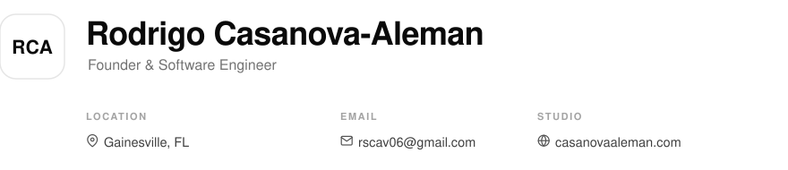
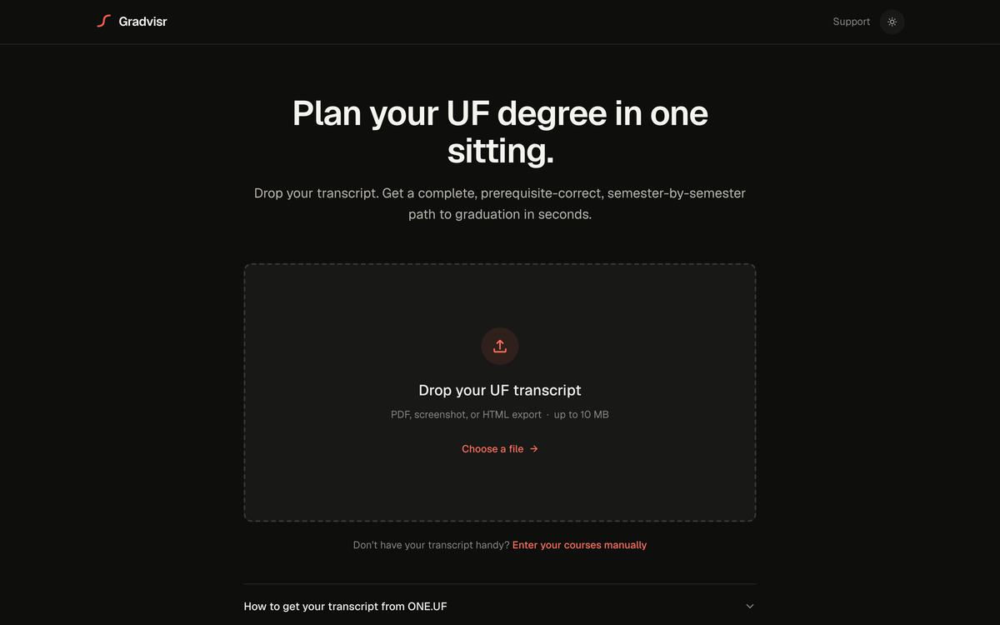
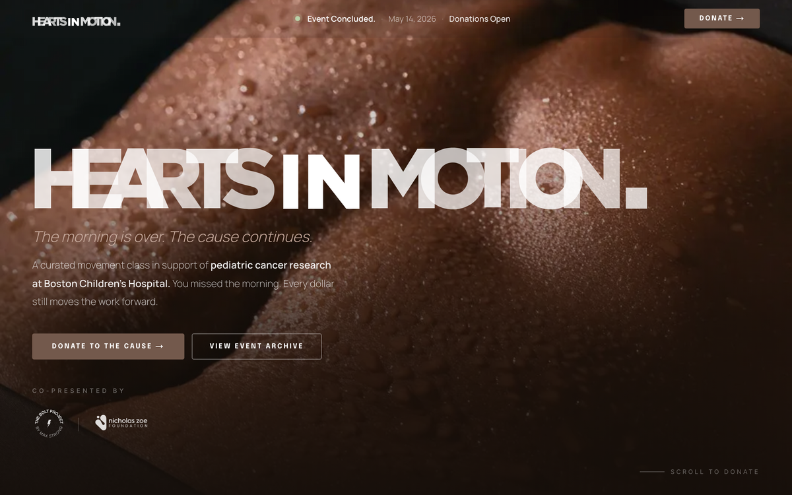

<!-- ───────────────────────────  HERO  ─────────────────────────── -->

<picture>
  <source media="(prefers-color-scheme: dark)" srcset="./assets/header-dark.svg">
  
</picture>

<!-- ───────────────────────────  BIO  ──────────────────────────── -->

I'm a developer and founder building products with an obsession for craft — the small details that make software feel effortless. I run **[Gradvisr](https://gradvisr.com)**, an AI degree planner, and design under **[Casanovaaleman](https://casanovaaleman.com)**, my web studio. Currently building with **TypeScript**, **Next.js**, **React**, and **Tailwind CSS**.

 

<!-- ──────────────────────  CONTRIBUTIONS  ─────────────────────── -->

#### CONTRIBUTIONS

**1,068** contributions in the last year

 

<!-- ─────────────────────────  TECH STACK  ─────────────────────── -->

#### TECH STACK

 

<!-- ──────────────────────  FEATURED PROJECTS  ─────────────────── -->

#### FEATURED PROJECTS

<table>
<tr>
<td width="50%" valign="top">

  
<b>Gradvisr</b> &nbsp;·&nbsp; <a href="https://gradvisr.com">gradvisr.com</a>
 
AI degree planner that turns a UF transcript into a complete, prerequisite-correct path to graduation in seconds.
  

</td>
<td width="50%" valign="top">

  
<b>Hearts in Motion</b> &nbsp;·&nbsp; <a href="https://heartsinmotion.events">heartsinmotion.events</a>
 
Live event platform for a pediatric-cancer research charity — RSVPs, sponsor tiers, and a cinematic donation flow.
  

</td>
</tr>
</table>

 

<!-- ─────────────────────────  FOOTER  ─────────────────────────── -->

#### LET'S BUILD SOMETHING

Studios and startups hire me to design and ship web products end-to-end. If you have something in mind — [**casanovaaleman.com**](https://casanovaaleman.com) or [**rscav06@gmail.com**](mailto:rscav06@gmail.com).
