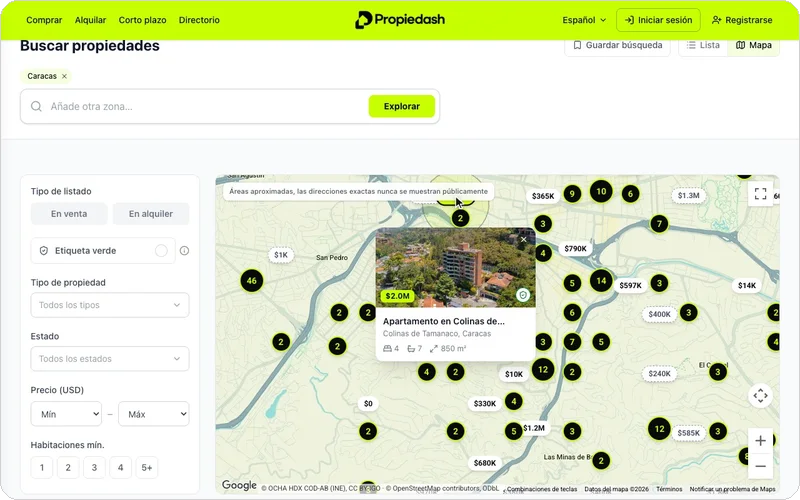
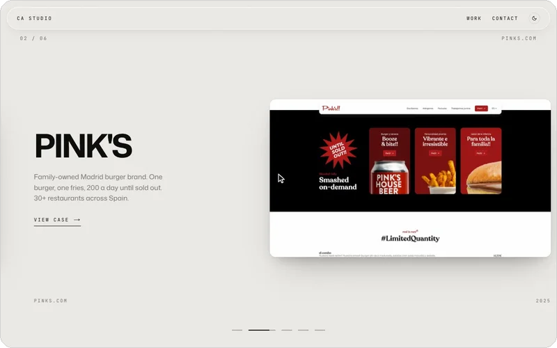

<picture>
  <source media="(prefers-color-scheme: dark)" srcset="./assets/keep-moving-dark.svg">
  
</picture>

<a href="https://propiedash.com"><picture><source media="(prefers-reduced-motion: reduce)" srcset="./assets/card-propiedash.webp"><source media="(prefers-color-scheme: dark)" type="image/avif" srcset="./assets/card-propiedash-dark.avif"><source type="image/avif" srcset="./assets/card-propiedash-light.avif"></picture></a>
<a href="https://casanovaaleman.com"><picture><source media="(prefers-reduced-motion: reduce)" srcset="./assets/card-ca-studio.webp"><source media="(prefers-color-scheme: dark)" type="image/avif" srcset="./assets/card-ca-studio-dark.avif"><source type="image/avif" srcset="./assets/card-ca-studio-light.avif"></picture></a>

**Co-founder of [Propiedash](https://propiedash.com).** Where Venezuela buys, sells and rents.

**Founder of [CA Studio](https://casanovaaleman.com).** Building software, websites and design.

[LinkedIn](https://www.linkedin.com/in/rodrigo-casanova-aleman/) · [Instagram](https://www.instagram.com/rodricasanovaa/) · [X](https://x.com/RSCAV06)
